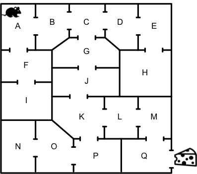

# Reinforced learning 101: a beginner's tutorial in python

## What is reinforced learning?

Reinforced Learning (RL) refers to a class of problems where the goal is to learn (from experiences) what to do in 
different situations (or states of a system), so as to optimize a quantitative reward over time.

Mathematically, this can be translated into the identification of the function f(s,a), which gives for each state of the 
system s, the best action policy a, to maximize a reward r. The theoretical principles of this type of learning are the 
Markov decision processes and the optimal control theory.

## Typical reinforcement scenario

Reinforced learning differs from other types of Machine Learning because the machine is not trained with an input 
dataset, instead it learns by trial and error. We often talk about an "agent" instead of a model, because the goal here 
is to learn how to choose actions over time. 

In the absence of input data, the agent learns through experience to make 
choices. It is through the exploration of the states of a given environement and the available actions that the agent 
builds his learning examples ("this action was good", "this action was bad"), then, by trial and error, he identifies 
the policy that maximizes its long-term reward.

Figure 1 shows a typical learning scenario for reinforced learning in which An agent performs an action on 
the environment, this action is interpreted as a reward and a representation of the new state, and this new 
representation is passed to the agent.


*Figure 1. Typical reinforcement scenario*


## What is Q-learning?

Q-learning is probably the most used reinforced algorithm because of its simplicity. It is based on the learning of a 
function of the values ​​of the actions. This function represents "the expected utility for a given action, followed by an 
optimal policy". A policy is a set of rules that an agent follows to choose their actions based on states. The problem 
is thus composed of an agent, which can evolve in a set of states S, and which can choose in a set of actions A. The 
execution of an action in a state gives a reward r. The goal of the agent is to maximize his rewards. He must therefore 
identify what is the optimal action for each state, i.e. the one giving the greatest reward in the long run.

The Q-Learning algorithm therefore seeks to construct the Q-value function, (also called Q-table), which contains the 
maximum future rewards stretched for an action at each state. To illustrate this, let's take the example of a mouse 
(our agent) learning the shortest way out of a maze with 11 pieces as shown in Figure 2.



*Figure 2. Maze*


Code

```markdown
Syntax highlighted code block

# Header 1
## Header 2
### Header 3

- Bulleted
- List

1. Numbered
2. List

**Bold** and _Italic_ and `Code` text

[Link](url) and 
```

For more details see [GitHub Flavored Markdown](https://guides.github.com/features/mastering-markdown/).

### Jekyll Themes

Your Pages site will use the layout and styles from the Jekyll theme you have selected in your [repository settings](https://github.com/simontamayo/tutorial_rl/settings). The name of this theme is saved in the Jekyll `_config.yml` configuration file.

### Support or Contact

Having trouble with Pages? Check out our [documentation](https://help.github.com/categories/github-pages-basics/) or [contact support](https://github.com/contact) and we’ll help you sort it out.
